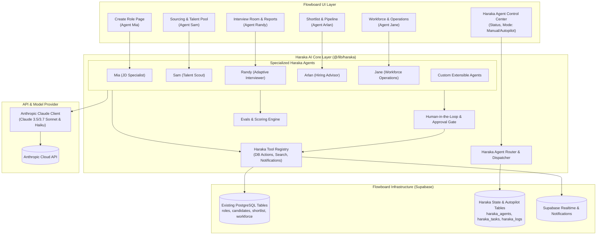
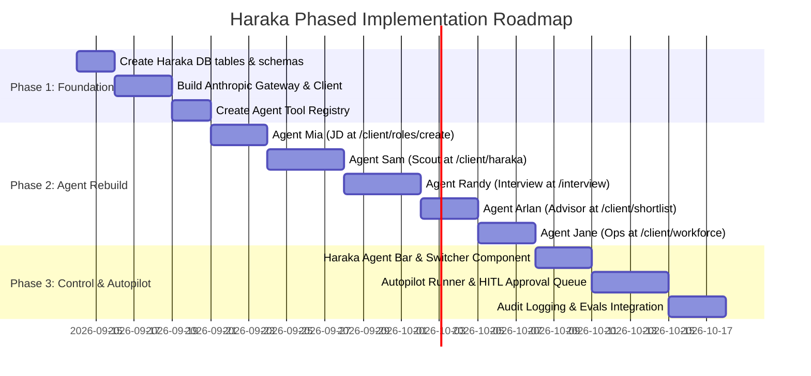

# HARAKA INTEGRATION ARCHITECTURE
## AI Workforce Layer Inside Flowboard Team

**Document Version:** 1.0.0  
**Target Platform:** Flowboard Team Web Application  
**Primary AI Engine:** Anthropic Claude API (Claude 3.5 Sonnet / Claude 3.7 Sonnet / Claude 3.5 Haiku)  
**Status:** Architectural Blueprint & Proposal — Pending User Review & Approval  

---

## Executive Summary & Core Directives

**Haraka** is the unified AI workforce layer integrated natively **inside Flowboard Team**. It is not a separate application, satellite service, or parallel database. It operates directly upon Flowboard's core relational data models, multi-tenant permission boundaries, and existing UI workflows.

### Non-Negotiable Architectural Principles:
1. **Zero Duplicate Identity:** Uses Flowboard's existing Supabase Auth (`auth.users`) and user profiles (`profiles`).
2. **Zero Duplicate Multi-Tenancy:** Uses Flowboard's existing Organization/Group hierarchy (`groups`, `group_members`).
3. **Zero Duplicate Entities:** 
   - No duplicate candidate pool (reusing `profiles` where `role_type = 'talent'`, `candidates`, `shortlisted_talent`, `role_shortlist`).
   - No duplicate job database (reusing `roles` and `jobs`).
   - No duplicate employee database (reusing `workforce_members` and `employment_history`).
   - No duplicate interview engine (reusing `job_competencies`, `invitations`, `interview_sessions`, `interview_messages`, `interview_reports`).
4. **Unified Multi-Agent System:** Five dedicated specialized agents:
   - **Mia (JD Agent):** Operates at `/client/roles/create` to structure, analyze, and optimize requisitions.
   - **Sam (Talent Scout Agent):** Operates at `/client/roles/:id/source`, `/client/haraka`, and `/client/talent-pool` to mine, match, and surface talent.
   - **Randy (Interview Agent):** Operates at `/interview/:token` and `/client/interviews` to run adaptive, competency-driven candidate assessments.
   - **Arlan (Hiring Advisor Agent):** Operates across `/client/shortlist` and candidate comparison views to recommend, benchmark, and detect pipeline bottlenecks.
   - **Jane (Workforce & Operations Agent):** Operates at `/client/workforce`, `/client/eor`, and `/client/contractors` to automate contract generation, compliance, and onboarding.
5. **Agent Control Center (On-Demand & Autopilot):** Unified UI controls enabling recruiters to activate any agent interactively or put agents into an autonomous **Autopilot** mode within strict guardrails. Extensible for custom user-created agents.
6. **Anthropic Integration:** Replaces scattered Gemini calls with a standardized Anthropic Claude client layer with structured tool calling, prompt caching, and streaming.

---

## Part 1: Comprehensive Codebase Inspection (Items 1 – 22)

Based on a thorough, end-to-end analysis of the Flowboard codebase (`/Users/georgealeesu/Projects/Flowboard/flowboard/flowboard`), here is the precise technical reality of each component:

### 1. Frontend Architecture
- **Framework & Runtime:** React 19.2.3, Vite 7.2.7, Bun 1.3.4 package manager, TypeScript 5.8.3.
- **Styling & UI Kit:** Tailwind CSS 3.4.17 with `@tailwindcss/typography`, `tailwindcss-animate`, Radix UI primitives (`@radix-ui/react-*`), Shadcn/ui component library, Lucide React icons (`v0.556.0`), and Framer Motion (`v12.23.26`).
- **Routing:** `react-router-dom` v6.30.1 with three primary surface zones:
  - **Client Portal (`/client/*`):** Wrapped in `src/pages/client/dashboard/Layout.tsx` providing sidebar navigation, notifications dropdown, active group switching, and light/dark theme toggling.
  - **Talent Portal (`/talent/*`):** Wrapped in `src/pages/talent/dashboard/Layout.tsx` providing candidate dashboard, job marketplace, applications, contract change approvals, and invoices.
  - **Public & Candidate Routes:** Public job postings (`/jobs/:id`), public talent profiles (`/talent/:username`), and AI candidate assessment rooms (`/interview/:token`, `/interview/:token/session`).
- **Client State:** React Context (`GroupContext`), TanStack React Query (`@tanstack/react-query`), and local storage caching.

### 2. Backend Architecture
- **Current Model:** Backend-as-a-Service (BaaS) powered by Supabase.
- **Direct Client-to-Postgres:** Client components and lib utilities invoke `@supabase/supabase-js` directly (`supabase.from("...").select(...)`).
- **Missing Server Layer:** There is currently no dedicated Express, Nest, or Fastify API server, and no deployed Supabase Edge Functions in the workspace repo. AI calls are executed directly from browser clients via SDKs.

### 3. Database and ORM
- **Engine:** PostgreSQL (managed by Supabase).
- **Driver/Querying:** PostgREST via `@supabase/supabase-js`. No heavy ORM (Prisma or Drizzle) is used; typed queries are written via table names and select chains.
- **Migrations:** SQL migration scripts located in `supabase/migrations/`:
  - `20240520_create_payroll.sql`: Payroll runs, items, deductions, and tax rates.
  - `20240729_create_project_boards_cards.sql`: Kanban project boards and task cards.
  - `20260730_allow_talent_project_board_select.sql`: RLS permissions for talent to view assigned boards.
  - `20260818_ai_interview_system.sql`: Companies, jobs, competencies, candidates, invitations, interview sessions, messages, and evaluation reports.

### 4. Authentication System
- **Provider:** Supabase Auth (JWT-based session management).
- **Auth Modes:** Email/Password and OAuth (Google, GitHub) handled via `supabase.auth.signInWithPassword` and `signInWithOAuth`.
- **Session Routing & Guardrails:** Managed in `src/components/ProtectedRoutes.tsx`. Validates session existence, checks profile `role_type` ('client' vs 'talent'), verifies onboarding state, and protects against cross-role route leakage.

### 5. Organisation / Company Model
- **Primary Tenant Abstraction:** `groups` table:
  - Fields: `id`, `organization_id` (links to creator's `auth.users.id`), `name`, `status`, `bio`, `is_primary`, `is_locked`, `admin_count`, `contract_count`, `created_at`, `updated_at`.
- **Membership & RBAC:** `group_members` table:
  - Links `group_id` with `user_id` and a role enum: `'owner' | 'admin' | 'member' | 'viewer'`.
- **Invitations:** `group_invitations` table with token-based email invites.
- **Active State Provider:** `src/contexts/GroupContext.tsx` maintains `activeGroup`, loads user groups, persists `activeGroupId` in `localStorage`, and injects active tenant scope across all client pages.
- **Secondary / Legacy Entity:** `companies` table (created in interview schema), linking `company_id` on `jobs`. Can be unified with `groups`.

### 6. User Model
- **Authentication Record:** `auth.users` (Supabase system schema: `id`, `email`, `user_metadata`).
- **Application Profile:** `public.profiles` table:
  - `id` (UUID, PK, matches `auth.users.id`)
  - `role_type` ('client' | 'talent')
  - `full_name`, `username`, `email`, `avatar_url`
  - `primary_role`, `skills` (text array), `bio`, `location`
  - `portfolio_url`, `github_url`, `linkedin_url`, `resume_url`
  - `onboarding_completed` (boolean), `is_visible` (boolean)
  - `theme_preference` ('light' | 'dark')
  - `created_at`, `updated_at`

### 7. Roles and Permissions
- **System Personas:** Distinct `client` and `talent` personas.
- **Group Roles:** `owner`, `admin`, `member`, `viewer` stored on `group_members`.
- **Permission Matrix in UI:** `user_permissions` calculated in `GroupContext`:
  - `can_edit`, `can_invite`, `can_delete`.
- **Data Protection:** PostgreSQL Row Level Security (RLS) enforcing `organization_id = auth.uid()` or group membership checks.

### 8. Candidate / Talent Models
Flowboard has three complementary candidate layers that Haraka must coordinate rather than duplicate:
1. **Platform Talent (`profiles`):** Registered marketplace users (`role_type = 'talent'`) with public profiles, verified skills, and availability.
2. **Interview Candidates (`candidates`):** Target candidates for job requisitions (`id`, `full_name`, `email`, `phone`, `linkedin_url`, `github_url`, `resume_url`, `skills`, `experience_years`, `current_title`, `location`).
3. **Shortlisted / Sourced Talent:**
   - `shortlisted_talent`: External talent mined via GitHub or discovered via Haraka (`user_id`, `group_id`, `github_id`, `full_name`, `match_score`, `seniority_label`, `bio`, `github_url`, `repos_count`, `followers_count`).
   - `role_shortlist`: Specific candidates placed into a requisition pipeline (`role_id`, `talent_id`, `talent_name`, `match_score`, `status`: `'shortlisted' | 'contacted' | 'screening' | 'interviewing' | 'offered' | 'hired' | 'rejected'`).
   - `hire_inquiries`: Offers and direct engagement requests (`user_id`, `group_id`, `talent_id`, `role_id`, `status`: `'pending' | 'accepted' | 'rejected' | 'withdrawn' | 'negotiating'`).

### 9. Job / Requisition Models
- **Client Requisitions (`roles` table):**
  - Columns: `id`, `user_id`, `group_id`, `title`, `department`, `type` (Full-time, Contract, Part-time), `location`, `location_details`, `salary`, `salary_currency`, `salary_min`, `salary_max`, `salary_period`, `experience_level`, `description`, `responsibilities` (text[]), `skills` (text[]), `benefits` (text[]), `education`, `other_requirements` (text[]), `status` ('open' | 'draft' | 'closed' | 'paused'), `applicants_count`.
- **Assessment Requisitions (`jobs` table):**
  - Used in the AI interview system with `job_competencies` for structured scoring.
  - Haraka will unify these so any `roles` record seamlessly provisions its corresponding `job_competencies`.

### 10. Recruitment Workflows
- **End-to-End Pipeline:**
  1. Role Creation: Manual multi-step or Haraka01 text prompt (`/client/roles/create`).
  2. Role Listing: Filter by status, search, and edit (`/client/roles`).
  3. Sourcing: Talent pool search (`/client/talent-pool`) and discovery engine (`/client/roles/:id/source` & `/client/haraka`).
  4. Shortlist Pipeline: Multi-stage Kanban tracking candidates (`/client/shortlist` and `/client/roles/:id/shortlist`).
  5. Hiring & Offer: Sending formal terms via `hire_inquiries` (`/client/offers`).

### 11. Interview System
- **Tables:** `job_competencies`, `invitations`, `interview_sessions`, `interview_messages`, `interview_reports`.
- **Candidate Interface:** Tokenized public entry (`/interview/:token`), terms consent, automated live chat with audio support (`AIInterviewRoom.tsx`), and completion summary.
- **Client Interface:** Automated scorecards (`/client/interviews` and `/client/interviews/:sessionId`) displaying overall score, recommendation ("Strongly Recommend" to "Not Recommended"), strengths, concerns, and competency evidence.

### 12. Employee / Workforce Models
- **Core Table (`workforce_members`):**
  - `id`, `organization_id`, `group_id`, `profile_id`, `full_name`, `email`, `role_title`, `department`, `location`, `start_date`, `end_date`, `payment_monthly`, `payment_currency`, `member_type` ('employee' | 'hired_contract' | 'hired_full_time'), `availability_status`, `online_status`, `is_active`, `notes` (JSON containing EOR and Contractor settings).
- **History & Modification (`employment_history` & `contract_change_requests`):**
  - Tracks compensation updates, contract amendments, title updates, and approvals.
- **Execution Units (`projects`, `project_members`, `project_boards`, `project_cards`):**
  - Internal project and task management with assigned workforce members.

### 13. Document Storage
- **Buckets:** Supabase Storage buckets `resumes` and `avatars`.
- **Document Management UI:** `src/pages/talent/DocumentsPage.tsx` and client contract briefing views tracking agreements, onboarding forms, and compliance artifacts.

### 14. Existing APIs
- **Supabase PostgREST & Auth REST APIs.**
- **Supabase Realtime WebSocket Gateway.**
- **GitHub Public REST API (`api.github.com/search/users`).**
- **Google Generative AI REST endpoint (via `@google/generative-ai` client SDK).**

### 15. Existing Background Jobs / Queues
- **Current State:** **None.** All logic runs in client browsers or as immediate Supabase queries.
- **Need:** Haraka Autopilot and multi-step agent reasoning require an execution environment (Supabase Edge Functions / background worker queue) so agents can work even when recruiters are offline.

### 16. Existing Notification System
- **Table:** `public.notifications` (`id`, `user_id`, `title`, `message`, `type`, `read`, `created_at`).
- **Live Dispatch:** Supabase Realtime channel `user-notifications-${user.id}` displaying in-app notifications and toast popups.

### 17. Existing Search Functionality
- Client-side in-memory filter matching across names, skills, departments, and titles.
- Multi-query GitHub developer search heuristics in `githubMiner.ts`.
- Postgres indexed queries (`.ilike()`, `.in()`).

### 18. Existing AI Functionality
- Currently uses Google Gemini Flash models via client-side keys:
  - `src/lib/haraka/promptParser.ts`: Gemini parses raw recruiter text into structured candidate search parameters.
  - `src/pages/client/roles/CreateRolePage.tsx`: Gemini generates job descriptions and requirements.
  - `src/lib/interviewAi.ts`: Gemini generates interview blueprints, dynamic questions, and evaluation reports.

### 19. Existing Integrations
- Supabase (Postgres, Auth, Storage, Realtime).
- GitHub (OAuth + Developer API).
- Google (OAuth).

### 20. Existing Audit Logging
- Limited to `employment_history` for workforce changes.
- No AI trace logging, prompt auditing, or agent decision tracking currently exists.

### 21. Existing Analytics
- Realtime frontend count aggregators on client pages (sourcing matches, pipeline stage counts, offer stats, project progress percentages).

### 22. Existing Billing / Subscription Architecture
- Flowboard payroll engine (`payroll_runs`, `payroll_items`, `payroll_tax_rates`, `payroll_deductions`).
- No SaaS customer billing or AI token usage limiter currently implemented.

---

## Part 2: What Haraka Reuses (Zero Duplication Guarantee)

| Flowboard Domain | Existing Tables & Code Reused by Haraka | What Haraka Adds (Without Duplication) |
| :--- | :--- | :--- |
| **Authentication** | `auth.users`, `src/components/ProtectedRoutes.tsx` | Reuses existing sessions and client JWTs; no secondary auth. |
| **Tenancy & Groups** | `groups`, `group_members`, `GroupContext.tsx` | All agent actions and configurations are scoped to `group_id` / `organization_id`. |
| **Users & Profiles** | `profiles` (talent & client) | Agent interactions attach directly to existing profile IDs. |
| **Jobs & Roles** | `roles`, `jobs`, `job_competencies` | Mia writes to `roles` and generates `job_competencies`; no new job table. |
| **Candidates** | `candidates`, `shortlisted_talent`, `role_shortlist` | Sam and Arlan discover and rank talent directly into these tables. |
| **Interviews** | `invitations`, `interview_sessions`, `interview_messages`, `interview_reports` | Randy orchestrates the assessment using these existing schemas. |
| **Workforce** | `workforce_members`, `employment_history`, `contract_change_requests` | Jane inspects and modifies workforce members using existing change request workflows. |
| **Notifications** | `notifications`, Supabase Realtime channel | Agents notify recruiters and talent through existing notification channels. |
| **Storage** | Supabase Storage (`resumes`, `avatars`) | Resume parsing and document inspection leverage existing buckets. |

---

## Part 3: The Haraka System Architecture



---

## Detailed Architectural Sections (A — P)

### A. Existing Flowboard Architecture
Flowboard is organized as a high-performance React 19 Single Page Application communicating directly with Supabase Postgres, Auth, Storage, and Realtime. Client-side state is orchestrated through `GroupContext` for multi-tenant switching. Client and Talent experiences are cleanly separated with dedicated layout shells and route guards.

### B. Existing Systems Haraka Should Reuse
1. **User Identity & Multi-Tenancy:** `auth.users`, `profiles`, `groups`, `group_members`, and `GroupContext`.
2. **Requisition Engine:** `roles` and `jobs`.
3. **Talent & Pipeline Engine:** `profiles` (platform talent), `candidates`, `shortlisted_talent`, and `role_shortlist`.
4. **Assessment Engine:** `job_competencies`, `invitations`, `interview_sessions`, `interview_messages`, and `interview_reports`.
5. **Workforce Management:** `workforce_members`, `employment_history`, `contract_change_requests`, and `projects`.
6. **Notification Subsystem:** `notifications` and Supabase Realtime pub/sub listeners.
7. **File Storage:** Supabase Storage `resumes` bucket.

### C. Missing Infrastructure Haraka Needs
1. **Anthropic SDK Integration:** Standardized Claude API service replacing legacy client Gemini calls.
2. **Haraka Agent State & Config Tables:** Database tables to store agent configurations (enabled/disabled, autopilot mode, temperature, system prompts) and agent task runs.
3. **Human-in-the-Loop (HITL) Action Approval Queue:** A mechanism for autopilot agents to stage sensitive actions (e.g. sending offers, rejecting candidates, changing salaries) for recruiter confirmation.
4. **Execution Tracing & Token Audit Log:** An audit log capturing prompt tokens, completion tokens, model latency, agent tool invocations, and output validity.
5. **Autopilot Background Runner:** Supabase Edge Functions or scheduled triggers to execute autopilot tasks asynchronously.

### D. Recommended Haraka Architecture
- **Unified Haraka Module:** Located cleanly at `src/lib/haraka/`.
- **Modular Agent Design:** Each agent is a discrete class/module implementing a common `HarakaAgent` interface with defined capabilities, tools, and system prompts.
- **Provider Gateway:** An Anthropic abstraction layer (`src/lib/haraka/anthropic/`) supporting tool calling, JSON schema enforcement, prompt caching, and streaming responses.
- **Global Agent Bar & Switcher:** An accessible Agent Control component allowing recruiters to inspect current agent statuses, activate on-demand actions, or toggle autopilot.

### E. Where the Haraka AI Layer Should Live in the Existing Codebase
```
src/
├── lib/
│   └── haraka/
│       ├── index.ts                     # Main entry point & Haraka agent registry
│       ├── anthropic/
│       │   ├── client.ts                # Anthropic client wrapper & configuration
│       │   ├── prompts.ts               # Base system prompts & guidelines
│       │   └── schemas.ts               # Structured JSON output schemas
│       ├── agents/
│       │   ├── baseAgent.ts             # HarakaAgent interface & base execution loop
│       │   ├── miaJDAgent.ts            # Mia — Role definition & JD optimization
│       │   ├── samScoutAgent.ts         # Sam — Talent discovery & matching
│       │   ├── randyInterviewAgent.ts   # Randy — Dynamic candidate assessment
│       │   ├── arlanAdvisorAgent.ts     # Arlan — Hiring decisions & benchmarking
│       │   ├── janeOperationsAgent.ts   # Jane — Workforce & contractor management
│       │   └── customAgent.ts           # Dynamic user-defined agents
│       ├── tools/
│       │   ├── registry.ts              # Agent tool definitions (Claude tool calling)
│       │   ├── roleTools.ts             # Read/write roles and competencies
│       │   ├── talentTools.ts           # Search talent, shortlist, score
│       │   ├── interviewTools.ts        # Trigger invites, fetch transcripts, grade
│       │   └── workforceTools.ts        # Inspect members, draft contract changes
│       ├── evals/
│       │   └── qualityChecker.ts        # Evals & guardrails for hallucination/drift
│       └── autopilot/
│           ├── taskRunner.ts            # Execution coordinator for autonomous tasks
│           └── approvalGate.ts          # Human-in-the-loop stage gate
├── components/
│   └── haraka/
│       ├── HarakaAgentBar.tsx           # Floating or embedded Agent status/activation widget
│       ├── HarakaAutopilotModal.tsx     # Autopilot scheduling and scope controls
│       ├── HarakaApprovalDrawer.tsx     # Recruiter review queue for pending agent actions
│       └── AgentAvatar.tsx              # Visual agent indicator (Mia, Sam, Randy, Arlan, Jane)
```

### F. Database Tables / Models Haraka Actually Needs
To avoid duplicating any business data, Haraka only introduces **three lightweight orchestration tables**:

```sql
-- 1. Agent Configuration per Group / Organization
CREATE TABLE IF NOT EXISTS public.haraka_agent_configs (
    id UUID PRIMARY KEY DEFAULT gen_random_uuid(),
    group_id UUID NOT NULL REFERENCES public.groups(id) ON DELETE CASCADE,
    agent_id TEXT NOT NULL, -- 'mia' | 'sam' | 'randy' | 'arlan' | 'jane' | custom_uuid
    name TEXT NOT NULL,
    is_active BOOLEAN NOT NULL DEFAULT true,
    autopilot_enabled BOOLEAN NOT NULL DEFAULT false,
    autopilot_settings JSONB NOT NULL DEFAULT '{
        "sourcing_limit_per_day": 25,
        "auto_invite_score_threshold": 85,
        "require_approval_for_offers": true
    }',
    custom_instructions TEXT,
    created_at TIMESTAMPTZ NOT NULL DEFAULT NOW(),
    updated_at TIMESTAMPTZ NOT NULL DEFAULT NOW(),
    CONSTRAINT unique_group_agent UNIQUE (group_id, agent_id)
);

-- 2. Pending Human-in-the-Loop Approvals (Autopilot Safety Gate)
CREATE TABLE IF NOT EXISTS public.haraka_pending_actions (
    id UUID PRIMARY KEY DEFAULT gen_random_uuid(),
    group_id UUID NOT NULL REFERENCES public.groups(id) ON DELETE CASCADE,
    agent_id TEXT NOT NULL,
    action_type TEXT NOT NULL, -- 'send_offer' | 'advance_candidate' | 'reject_candidate' | 'contract_change'
    target_entity_type TEXT NOT NULL, -- 'role' | 'candidate' | 'workforce_member'
    target_entity_id UUID NOT NULL,
    action_payload JSONB NOT NULL,
    rationale TEXT NOT NULL,
    status TEXT NOT NULL DEFAULT 'pending' CHECK (status IN ('pending', 'approved', 'rejected', 'executed')),
    reviewed_by UUID REFERENCES auth.users(id),
    reviewed_at TIMESTAMPTZ,
    created_at TIMESTAMPTZ NOT NULL DEFAULT NOW()
);

-- 3. Execution Tracing & Audit Log
CREATE TABLE IF NOT EXISTS public.haraka_execution_logs (
    id UUID PRIMARY KEY DEFAULT gen_random_uuid(),
    group_id UUID NOT NULL REFERENCES public.groups(id) ON DELETE CASCADE,
    user_id UUID REFERENCES auth.users(id),
    agent_id TEXT NOT NULL,
    trigger_mode TEXT NOT NULL CHECK (trigger_mode IN ('manual', 'autopilot', 'event')),
    model_name TEXT NOT NULL,
    prompt_tokens INT DEFAULT 0,
    completion_tokens INT DEFAULT 0,
    latency_ms INT DEFAULT 0,
    tool_calls JSONB DEFAULT '[]',
    status TEXT NOT NULL DEFAULT 'success' CHECK (status IN ('success', 'failed', 'blocked')),
    error_message TEXT,
    created_at TIMESTAMPTZ NOT NULL DEFAULT NOW()
);
```

### G. API Endpoints Haraka Needs
For client-side execution or Supabase Edge Functions:
1. `POST /api/haraka/mia/generate-jd`: Generates or refines job description, competencies, and interview criteria.
2. `POST /api/haraka/sam/discover`: Runs multi-channel talent mining (platform talent + external) against a requisition spec.
3. `POST /api/haraka/randy/next-question`: Generates adaptive interview questions based on transcript and competency evaluation criteria.
4. `POST /api/haraka/randy/evaluate`: Produces an evidence-based assessment scorecard from an interview session.
5. `POST /api/haraka/arlan/analyze-shortlist`: Evaluates candidates in a shortlist, highlights top matches, and recommends stage transitions.
6. `POST /api/haraka/jane/draft-contract`: Generates compliance-ready contract terms and EOR/contractor settings for a role.
7. `POST /api/haraka/actions/approve`: Executes a staged human-in-the-loop action.
8. `POST /api/haraka/autopilot/tick`: Evaluates autopilot rules and triggers background agent tasks.

### H. Permission Requirements
- **Tenant Isolation:** Every Haraka query, configuration, and log must filter on `group_id = activeGroup.id`.
- **Role Permissions:**
  - `owner` & `admin`: Full access to configure agents, toggle Autopilot, approve actions, and trigger any agent.
  - `member`: Can use on-demand agent assists (Mia, Sam, Randy, Arlan), but cannot toggle Autopilot or approve contractual changes.
  - `viewer`: Read-only access to agent logs and interview reports.

### I. Anthropic Integration Point
- **SDK:** `@anthropic-ai/sdk`.
- **Models:**
  - `claude-sonnet-4-6`: Primary engine for Haraka AI workforce (Mia for job requisitions, Randy for candidate assessment, Arlan for pipeline analysis, and Jane for workforce operations).
- **Features Used:**
  - **Tool Calling:** Agents declare Flowboard actions as Claude tools (e.g. `shortlist_candidate`, `generate_competencies`, `request_approval`).
  - **Structured JSON Outputs:** Schema-enforced responses.
  - **Prompt Caching:** Caches job descriptions and candidate resumes across conversational turns to cut latency and cost by up to 80%.

### J. RAG Integration Point (Retrieval-Augmented Generation)
- **Context Sources:**
  - Active company profile & group preferences (`groups.bio`, industry, guidelines).
  - Existing job postings and requirements from the same organization (`roles`).
  - Candidate resumes stored in Supabase Storage (`resumes` bucket).
  - Interview transcripts (`interview_messages`).
- **Implementation:**
  - Structured SQL retrieval filtering by `group_id`.
  - Future phase: pgvector embeddings on candidate resumes and past successful job hires for semantic similarity search.

### K. Evals Integration Point
- **Quality Guardrails:**
  - **Hallucination Check:** Asserts that interview evidence quotes strictly exist within the `interview_messages` transcript.
  - **Competency Sum Check:** Verifies that Mia's generated competency weights always total exactly 100%.
  - **Salary Sanity Check:** Verifies that drafted salaries conform to target location market bands.
  - **Schema Validation:** Zod schemas validate all LLM responses before database persistence.

### L. Agent Architecture & Specializations

```
┌─────────────────────────────────────────────────────────────────────────────┐
│                            HARAKA AGENT SUITE                               │
├───────────────┬───────────────────────────┬─────────────────────────────────┤
│ Agent         │ Flowboard Location        │ Primary Capabilities            │
├───────────────┼───────────────────────────┼─────────────────────────────────┤
│ 1. Mia        │ /client/roles/create      │ • Natural language JD drafting  │
│    (JD Agent) │ /client/roles/:id         │ • Skill & competency blueprint  │
│               │                           │ • Market salary benchmarking    │
├───────────────┼───────────────────────────┼─────────────────────────────────┤
│ 2. Sam        │ /client/roles/:id/source  │ • Platform talent matching      │
│    (Scout)    │ /client/haraka            │ • GitHub & external dev mining  │
│               │ /client/talent-pool       │ • Automated candidate scoring   │
├───────────────┼───────────────────────────┼─────────────────────────────────┤
│ 3. Randy      │ /interview/:token         │ • Adaptive conversational chat  │
│    (Interview)│ /client/interviews        │ • Evidence-based rubric scoring │
│               │                           │ • Strengths & concerns reports  │
├───────────────┼───────────────────────────┼─────────────────────────────────┤
│ 4. Arlan      │ /client/shortlist         │ • Pipeline stage progression    │
│    (Advisor)  │ /client/roles/:id/shortlist│• Multi-candidate comparison    │
│               │                           │ • Hiring probability ranking    │
├───────────────┼───────────────────────────┼─────────────────────────────────┤
│ 5. Jane       │ /client/workforce         │ • EOR vs Contractor compliance  │
│    (Ops)      │ /client/eor               │ • Contract amendment drafting   │
│               │ /client/contractors       │ • Onboarding checklist tracking │
└───────────────┴───────────────────────────┴─────────────────────────────────┘
```

### M. Human-in-the-Loop (HITL) Architecture
- **Autopilot Safety Levels:**
  - **Level 1 (Autonomous):** Read-only queries, candidate sourcing, initial draft generation, and assessment report creation.
  - **Level 2 (Semi-Autonomous with Approval Gate):** Shortlisting candidates, sending interview invitations.
  - **Level 3 (Strict Recruiter Approval Required):** Sending employment offers, rejecting candidates, modifying compensation, altering active contracts.
- **Approval Queue UI:** Recruiter sees a badge counter on the Haraka Bar; clicking opens `HarakaApprovalDrawer.tsx` to approve or reject with 1 click.

### N. Audit and Logging Requirements
- Every agent invocation writes a record to `haraka_execution_logs`.
- Logs include: timestamp, `agent_id`, `group_id`, `user_id`, prompt token count, completion token count, tools executed, and execution status.
- Provides recruiters with complete transparency into why an agent made a specific recommendation.

### O. Security Requirements
- **No Client API Key Exposure:** Anthropic API keys must never be exposed to public browser bundles. All Anthropic requests must run through a secure backend proxy or Supabase Edge Function with environment variable validation.
- **Candidate PII Protection:** Candidate PII (phone, private email) is sanitized before sending to LLM prompts.
- **Tenant Partitioning:** RLS policies prevent one organization's agents from querying another organization's candidates or requisitions.

### P. Recommended Implementation Order



---

## Conclusion & Next Steps

This architecture provides Flowboard with a production-grade, multi-agent AI workforce that leverages 100% of existing investments in users, organizations, candidate pipelines, requisitions, and interviews.

**Awaiting user approval before writing code or installing Anthropic packages.**
